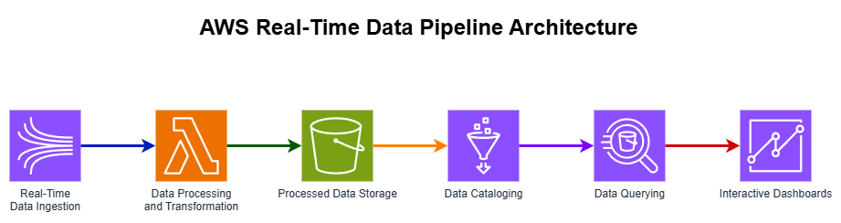
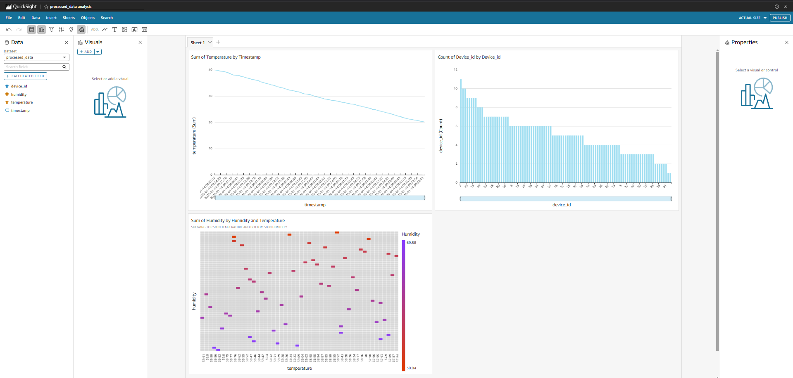

# **Real-Time Data Pipeline with AWS Services**

## **Project Overview**
This project demonstrates a scalable real-time data pipeline using AWS services. The pipeline processes streaming data from IoT devices or e-commerce transactions, stores and analyzes the data, and visualizes insights via AWS QuickSight.

---

## **Objective**
To design and implement a real-time data pipeline for ingesting, transforming, storing, and analyzing data efficiently using AWS services.

---

## **Architecture**
The pipeline is composed of the following AWS services:
1. **Amazon Kinesis**: For real-time data ingestion.
2. **AWS Lambda**: For processing and transforming streaming data.
3. **Amazon S3**: For storing raw and processed data.
4. **AWS Glue**: For cataloging data for querying.
5. **Amazon Athena**: For running SQL queries on the processed data.
6. **AWS QuickSight**: For interactive dashboards and data visualization.



---

## **Implementation Steps**

### **1. Kinesis Data Stream**
- Created a data stream named `IoTDataStream` with one shard for development.
- Simulated IoT or e-commerce data using a Python script.

### **2. Lambda Function**
- Implemented a Lambda function to:
  - Decode base64-encoded Kinesis data.
  - Transform raw data into JSON format.
  - Store processed data in S3.

### **3. Amazon S3**
- Configured an S3 bucket (`iot-stream-data`) to store:
  - Raw data.
  - Processed data in the folder `processed-data/`.

### **4. AWS Glue**
- Created a Glue Crawler to catalog processed data in S3.
- Verified the schema in the Glue Data Catalog.

### **5. Amazon Athena**
- Connected Athena to the Glue Data Catalog.
- Executed SQL queries for data analysis:
  - Example: Filter high-temperature events and count records per device.

### **6. AWS QuickSight**
- Connected QuickSight to Athena.
- Created dashboards to visualize:
  - Temperature trends over time (time series chart).
  - Device event counts (bar chart).
  - Humidity and temperature patterns (heat map).

---

## **Sample Data**
### IoT Device Data
```json
{
  "device_id": "device_001",
  "temperature": 22.5,
  "humidity": 55.3,
  "status": "active",
  "timestamp": "2025-01-14T08:00:00Z"
}
```

### E-Commerce Transaction Data
```json
{
  "transaction_id": "txn_001",
  "customer_id": "cust_001",
  "product_id": "prod_001",
  "quantity": 2,
  "price": 49.99,
  "timestamp": "2025-01-14T08:00:00Z"
}
```

---

## **Key Features**
- **Real-Time Processing**: Continuous ingestion of streaming data with Kinesis.
- **Scalable Storage**: Raw and processed data stored securely in S3.
- **Interactive Querying**: SQL queries using Athena to analyze large datasets.
- **Custom Visualizations**: Interactive dashboards in QuickSight.

---

## **Athena Queries**
### Example Queries
- Retrieve all records:
  ```sql
  SELECT * FROM processed_data;
  ```
- Count events per device:
  ```sql
  SELECT device_id, COUNT(*) AS event_count FROM processed_data GROUP BY device_id;
  ```

For more queries, refer to [`athena_queries.sql`](../queries/athena_queries.sql).

---

## **QuickSight Dashboards**
### Visualizations
- **Time Series Chart**: Tracks temperature trends over time.
- **Bar Chart**: Shows event counts per device.
- **Heat Map**: Highlights humidity and temperature patterns.

### Screenshot


---

## **Future Enhancements**
1. **Redshift Integration**: Store and query historical data for advanced analytics.
2. **Machine Learning**: Use SageMaker for anomaly detection and trend prediction.
3. **Real-Time Alerts**: Implement SNS for notifying critical events.
4. **Data Compression**: Optimize storage with Gzip or Parquet formats.

---

## **License**
This project is licensed under the MIT License. See the [LICENSE](../LICENSE) file for details.

---

## **Contributors**
- **Vikram Sharma** (Project Lead)
- Open for collaboration! Feel free to raise issues or create pull requests.

---

## **How to Run**
1. Clone this repository:
   ```bash
   git clone https://github.com/your-username/aws-realtime-data-pipeline.git
   ```
2. Deploy the Lambda function in the `lambda/` folder.
3. Simulate data using the sample data in `data-sample/`.
4. Query processed data using `athena_queries.sql`.
5. Visualize insights with QuickSight dashboards.
